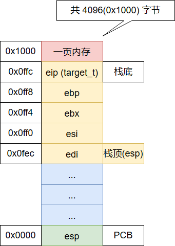

# 任务及上下文

## 任务

任务就是进程或者线程，协程，就是一个执行流；

- 程序入口地址
- 堆栈 - 内核栈
- 寄存器信息

## 什么是ABI
通过将当前执行环境的现场（如CPU寄存器）压入堆栈进行保存，然后在CPU的寄存器里面放入函数所需的参数，完成函数的调用。哪个参数放在AX里面，哪个放在BX里面，函数返回值在哪个寄存器里面，这个函数调用方和被调用方需要协商一致，否则就会驴唇马嘴不是？

这个约定，就是ABI。

所以，ABI实际上就是对于CPU如何执行函数调用的一种约定。静态库、动态库都是它的应用，而不是其原因。

## ABI 调用约定

Application Binary Interface

System V ABI

调用方保存：

- eax
- ecx
- edx

实现方保存，调用完成后寄存器值不变：

- ebx
- esi
- edi
- ebp
- esp

## 内存分页

4G / 4K = 1M

## 任务内存分布

## 参考文献

- <https://en.wikipedia.org/wiki/Application_binary_interface>
- <https://stackoverflow.com/questions/2171177/what-is-an-application-binary-interface-abi>
- <https://wiki.osdev.org/System_V_ABI>